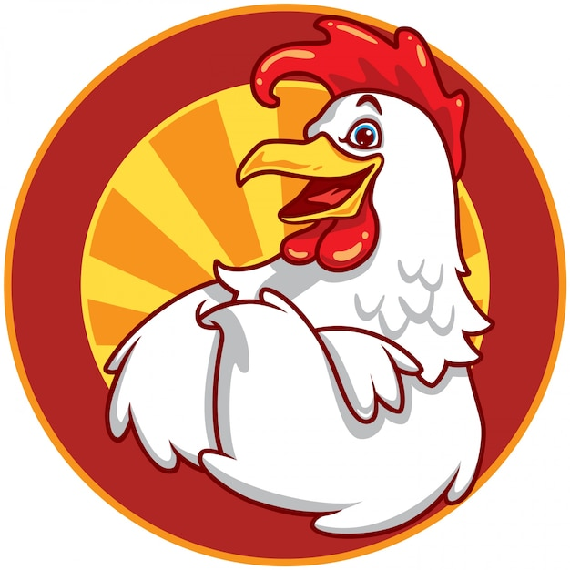
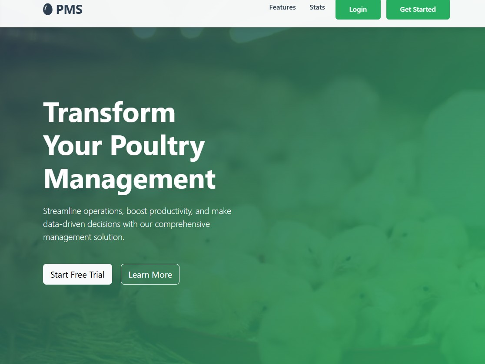
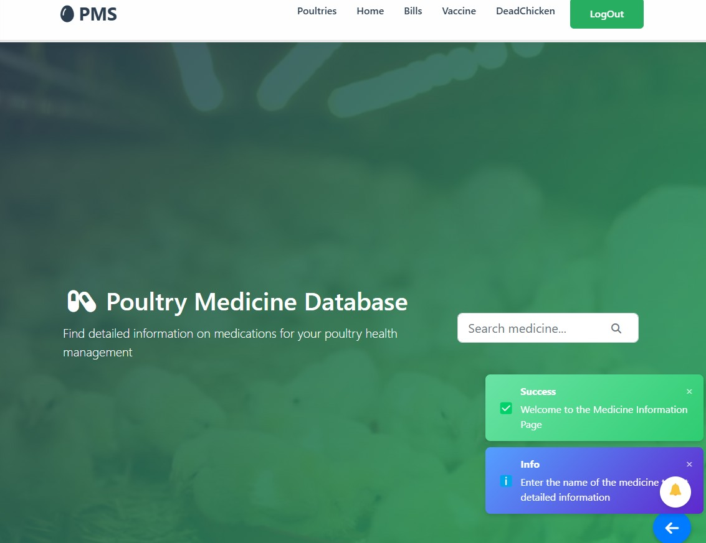
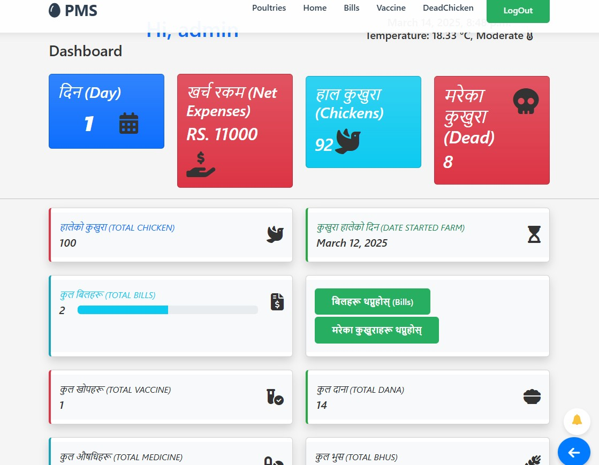

# PMS

<p align="center">
  
</p>

<p align="center">
  <a href="https://github.com/kushal1o1/PMS/stargazers"></a>
  <a href="https://github.com/kushal1o1/PMS/network/members"></a>
  <a href="https://github.com/kushal1o1/PMS/pulls"></a>
  <a href="https://github.com/kushal1o1/PMS/issues"></a>
  <a href="https://github.com/kushal1o1/PMS/graphs/contributors"></a>
</p>

<p align="center">
  <b>A Django-based web application for managing poultry records, tracking expenses, monitoring bird health, generating reports, and receiving real-time notifications.</b>
</p>

<p align="center">
  <a href="#features">Features</a> •
  <a href="#demo">Demo</a> •
  <a href="#installation">Installation</a> •
  <a href="#usage">Usage</a> •
  <a href="#configuration">Configuration</a> •
  <a href="#contributing">Contributing</a> •
  <a href="#license">License</a> •
  <a href="#contact">Contact</a> •
</p>


## Overview

Poultry Management System (PMS) is a comprehensive web application built with Django and Bootstrap to streamline poultry farm management. It allows users to track poultry records, manage expenses, monitor bird health, and generate detailed reports. The system includes features such as real-time notifications, automated email alerts, farm closing with profit/loss calculations, and a medicine search functionality powered by OpenAI API. Additionally, it provides an intuitive admin panel for efficient management of farms, bills, and mortality records. PMS ensures seamless farm operations with a user-friendly interface and robust data analytics.

## Features

- **User Authentication – Secure login and user management.**
- **Poultry Tracking – Manage and view poultry details**
- **Bill Management – Track expenses (feed, medicine, etc.).**
- **Dead Bird Tracking – Record and analyze mortality data.**
- **Medicine Search – Look up medicine info using OpenAI API.**
- **Farm Closing – Calculate profit/loss when closing a farm**
- **Real-time Notifications – Django Channels for live updates.**
- **PDF Reports – Generate detailed farm reports**
- **Email Alerts – Automated emails via Django signals.**
- **Admin Dashboard – Manage farms, bills, and records easily.**


## Demo

<p align="center">
  
</p>

## Screenshot




## Installation
```bash
# Clone the repository
git clone https://github.com/kushal1o1/PMS.git

# Navigate to the project directory
cd PMS

pip install -r requirements.txt
```
### Prerequisites
- **Python 3.x – Ensure Python is installed.**
- **Django – Web framework for backend development.**
- **SQLite / PostgreSQL – Default database (can be configured).**
- **Virtual Environment – Recommended for dependency management.**
- **SMTP Email Configuration – For sending automated emails.**
- **Django Channels,python-decouple,reportlab You Can refer requirements.txt**
- **Redis & Daphne (For WebSockets) – Required for real-time notifications.**


## Usage

```bash
uvicorn PMS.asgi:application --port 8000 --workers 4 --log-level debug  --reload
```
## Configuration

### Configuration File
Configure Environment Files and Install Prerequisites from requirements.txt.
using
```python
pip install -r  requirements.txt
```

### Environment Variables

| Variable | Description | Default |
|----------|-------------|---------|
| `SECRET_KEY` | securekey | `any` |
| `DEBUG` | Bolean | `True/False` |
| `EMAIL_HOST` | emailhost | `--` |
| `EMAIL_USE_TLS` | bolean | `True/False` |
| `EMAIL_HOST_USER` | user | `--` |
| `EMAIL_HOST_PASSWORD` | password | `--` |
| `EMAIL_PORT` | port | `--` |
| `OPENWEATHER_API_KEY` | yourapi | `--` |
| `OPENAI_API_KEY` | openaikey | `--` |
| `Backend:` | Django | `(Python)` |


## Directory Structure

```
/PMS/
├── .gitignore
├── PMS/
│   ├─] .env (ignored)
│   ├── authenticate/
│   │   ├── admin.py
│   │   ├── apps.py
│   │   ├── migrations/
│   │   │   ├── __init__.py
│   │   │ 
│   │   ├── models.py
│   │   ├── Service.py
│   │   ├── static/
│   │   │   └── images/
│   │   ├── templates/
│   │   │   ├── emails/
│   │   │   │   ├── email_confirmation.html
│   │   │   │   └── WelcomeEmail.html
│   │   │   ├── index.html
│   │   │   └── pageNotFound.html
│   │   ├── tests.py
│   │   ├── tokens.py
│   │   ├── urls.py
│   │   ├── views.py
│   │   ├── __init__.py
│   ├── db.sqlite3
│   ├── manage.py
│   ├── media/
│   │   └── images/
│   ├── PMS/
│   │   ├── asgi.py
│   │   ├── settings.py
│   │   ├── urls.py
│   │   ├── wsgi.py
│   │   ├── __init__.py
│   ├── requirements.txt
│   ├── TODO.py
│   ├── userhome/
│   │   ├── admin.py
│   │   ├── apps.py
│   │   ├── consumers.py
│   │   ├── migrations/
│   │   │   ├── __init__.py
│   │   ├── models.py
│   │   ├── routing.py
│   │   ├── service.py
│   │   ├── signals.py
│   │   ├── static/
│   │   │   └── images/
│   │   ├── templates/
│   │   │   ├── Base.html
│   │   │   ├── mainpage.html
│   │   │   ├── medicine.html
│   │   │   ├── notifications.html
│   │   │   ├── pageNotFound.html
│   │   │   ├── profile.html
│   │   │   ├── showbills.html
│   │   │   ├── showdeads.html
│   │   │   └── showVaccine.html
│   │   ├── tests.py
│   │   ├── urls.py
│   │   ├── views.py
│   │   ├── __init__.py
└── README.md

```
## Technologies Used

<p align="center">


</p>

## Contributing

Contributions are what make the open source community such an amazing place to learn, inspire, and create. Any contributions you make are **greatly appreciated**.

1. Fork the Project
2. Create your Feature Branch (`git checkout -b feature/AmazingFeature`)
3. Commit your Changes (`git commit -m 'Add some AmazingFeature'`)
4. Push to the Branch (`git push origin feature/AmazingFeature`)
5. Open a Pull Request

Please make sure to update tests as appropriate and adhere to the [code of conduct](CODE_OF_CONDUCT.md).

## License

This project is licensed under the MIT License.

## Contact

share.kusal@gmail.com

## Discliamer
The Hosted Version is still Old version .

---

<p align="center">
  Made with ❤️ by <a href="https://github.com/kushal1o1">kushal1o1</a>
</p>

